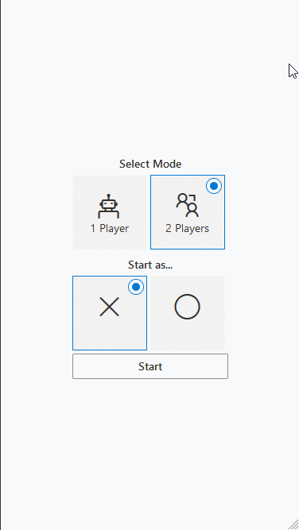

# ttt-game-react

Tic-tac-toe game made with ReactJS.
In single player mode, any random empty tile will be selected to mimic a second player.

To check out the project...

> Clone / Download zip

> run "npm install" (will require node and npm)

> run "npm start"

Feedback is appreciated. Thank you!
